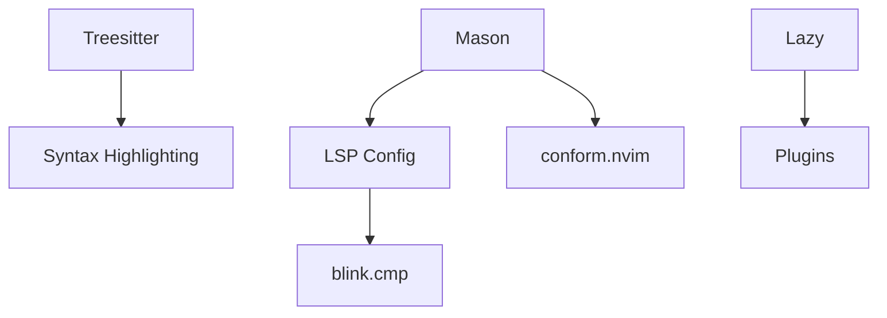

# Feature Landscape

**Domain:** Modern Neovim Configuration
**Researched:** 2024-11-20

## Table Stakes

Features users expect in a modern IDE-like Neovim experience.

| Feature | Why Expected | Complexity | Implementation |
|---------|--------------|------------|----------------|
| Intelligent Completion | LSP-aware snippets and path completions. | Medium | `blink.cmp` |
| Syntax Highlighting | Beyond regex-based syntax for fast, precise highlighting. | Low | `nvim-treesitter` |
| Fuzzy Finder | Quickly jumping to files, grep, and symbols. | Low | `snacks.picker` |
| LSP Management | Installing and configuring language servers. | Medium | `mason.nvim` + `nvim-lspconfig` |
| Auto-Formatting | Formatting code on save without blocking the UI. | Low | `conform.nvim` |
| File Explorer | Navigation for larger projects. | Low | `snacks.explorer` or `oil.nvim` |

## Differentiators

Features that set a modern "high-performance" configuration apart from generic setups.

| Feature | Value Proposition | Complexity | Implementation |
|---------|-------------------|------------|----------------|
| Built-in Dashboard | Fast startup with useful "recent" and "session" links. | Low | `snacks.dashboard` |
| Notification Engine | Non-blocking UI messages and history. | Low | `snacks.notifier` |
| Native Snippets | Using Neovim 0.10's built-in snippet support for less bloat. | Medium | Neovim Core + `blink.cmp` |
| Git Integration | In-buffer git signs and fast blame/history viewing. | Low | `snacks.git` |
| High-Speed Picking | Sub-millisecond fuzzy matching for millions of files. | Low | `snacks.picker` |

## Anti-Features

Features to explicitly NOT build or plugins to avoid in modern setups.

| Anti-Feature | Why Avoid | What to Do Instead |
|--------------|-----------|-------------------|
| `null-ls` | Archived and slow. | `conform.nvim` + `nvim-lint`. |
| `nvim-cmp` | Replaced by `blink.cmp` for performance. | `blink.cmp`. |
| `alpha-nvim` | Complex config for a simple dashboard. | `snacks.dashboard`. |
| Heavy Snippet Libraries | `LuaSnip` is often overkill for simple needs. | Neovim 0.10+ native snippets. |

## Feature Dependencies

## MVP Recommendation

To build a high-performance modern Neovim setup, prioritize:
1. **Completion & LSP**: Using `blink.cmp` and `lspconfig`.
2. **Unified UI**: Using `snacks.nvim` for everything (Dashboard, Picker, Notifications).
3. **Smart Highlighting**: `nvim-treesitter`.

Defer: Complex custom statuslines or heavy icons until the core is stable.

## Sources

- [Modern Neovim Setup 2024 (Ecosystem Analysis)](https://dotfyle.com/)
- [LazyVim 2024 Updates](https://lazyvim.org)
